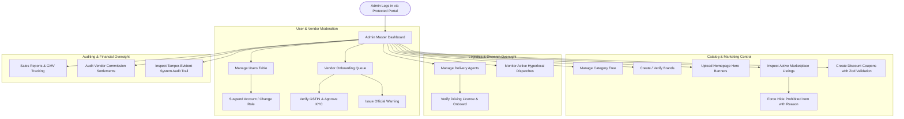

# Administrator Governance & Operations Workflow

```mermaid
flowchart TD
    AdminLogin([Admin Logs in via Protected Portal]) --> Dash[Admin Master Dashboard]
    
    subgraph UserManagement["User & Vendor Moderation"]
        Dash --> Users[Manage Users Table]
        Users --> Suspend[Suspend Account / Change Role]
        Dash --> Vendors[Vendor Onboarding Queue]
        Vendors --> ApproveKYC[Verify GSTIN & Approve KYC]
        Vendors --> WarnVendor[Issue Official Warning]
    end

    subgraph CatalogControl["Catalog & Marketing Control"]
        Dash --> Categories[Manage Category Tree]
        Dash --> Brands[Create / Verify Brands]
        Dash --> Banners[Upload Homepage Hero Banners]
        Dash --> Listings[Inspect Active Marketplace Listings]
        Listings --> ForceHide[Force Hide Prohibited Item with Reason]
        Dash --> Coupons[Create Discount Coupons with Zod Validation]
    end

    subgraph LogisticsControl["Logistics & Dispatch Oversight"]
        Dash --> Agents[Manage Delivery Agents]
        Agents --> ApproveAgent[Verify Driving License & Onboard]
        Dash --> LiveMap[Monitor Active Hyperlocal Dispatches]
    end

    subgraph FinancialAuditing["Auditing & Financial Oversight"]
        Dash --> Reports[Sales Reports & GMV Tracking]
        Dash --> Settlements[Audit Vendor Commission Settlements]
        Dash --> AuditLogs[Inspect Tamper-Evident System Audit Trail]
    end
```
