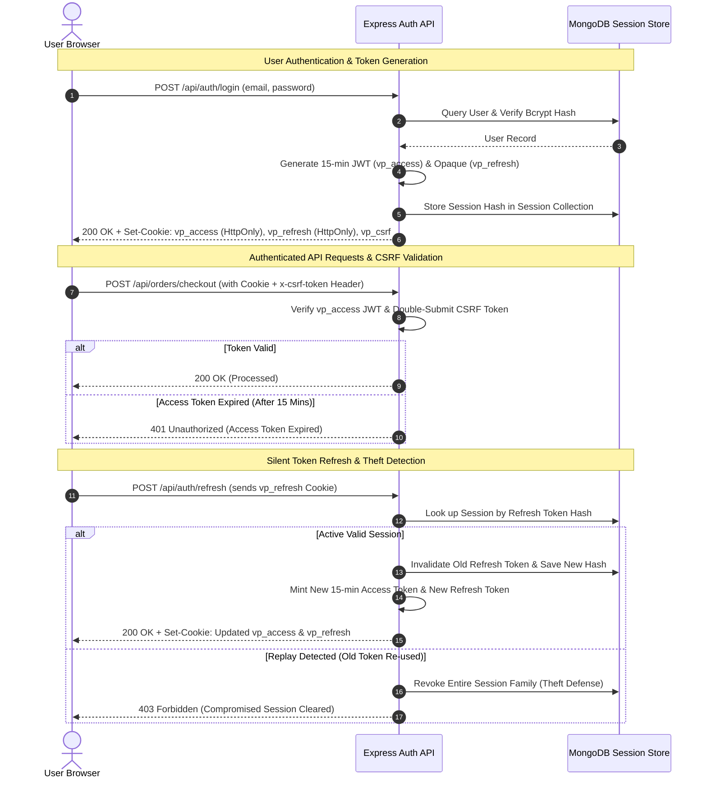

# Authentication, Session & Token Rotation Lifecycle

```mermaid
sequenceDiagram
    autonumber
    actor User as User Browser
    participant API as Express Auth API
    participant DB as MongoDB Session Store

    Note over User, DB: User Authentication & Token Generation
    User->>API: POST /api/auth/login (email, password)
    API->>DB: Query User & Verify Bcrypt Hash
    DB-->>API: User Record
    API->>API: Generate 15-min JWT (vp_access) & Opaque (vp_refresh)
    API->>DB: Store Session Hash in Session Collection
    API-->>User: 200 OK + Set-Cookie: vp_access (HttpOnly), vp_refresh (HttpOnly), vp_csrf

    Note over User, DB: Authenticated API Requests & CSRF Validation
    User->>API: POST /api/orders/checkout (with Cookie + x-csrf-token Header)
    API->>API: Verify vp_access JWT & Double-Submit CSRF Token
    alt Token Valid
        API-->>User: 200 OK (Processed)
    else Access Token Expired (After 15 Mins)
        API-->>User: 401 Unauthorized (Access Token Expired)
    end

    Note over User, DB: Silent Token Refresh & Theft Detection
    User->>API: POST /api/auth/refresh (sends vp_refresh Cookie)
    API->>DB: Look up Session by Refresh Token Hash
    alt Active Valid Session
        API->>DB: Invalidate Old Refresh Token & Save New Hash
        API->>API: Mint New 15-min Access Token & New Refresh Token
        API-->>User: 200 OK + Set-Cookie: Updated vp_access & vp_refresh
    else Replay Detected (Old Token Re-used)
        API->>DB: Revoke Entire Session Family (Theft Defense)
        API-->>User: 403 Forbidden (Compromised Session Cleared)
    end
```
