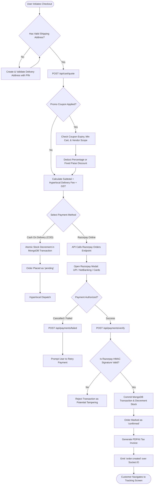

# Checkout, Inventory Reservation & Payment Workflow

```mermaid
flowchart TD
    Start([User Initiates Checkout]) --> AddressCheck{Has Valid Shipping Address?}
    
    AddressCheck -- No --> NewAddress[Create & Validate Delivery Address with PIN]
    NewAddress --> AddressCheck
    AddressCheck -- Yes --> PricingQuote[POST /api/cart/quote]
    
    PricingQuote --> DiscountCheck{Promo Coupon Applied?}
    DiscountCheck -- Yes --> ValidateCoupon[Check Coupon Expiry, Min Cart, & Vendor Scope]
    ValidateCoupon --> ApplyDiscount[Deduct Percentage or Fixed Paise Discount]
    DiscountCheck -- No --> BasePrice[Calculate Subtotal + Hyperlocal Delivery Fee + GST]
    ApplyDiscount --> BasePrice
    
    BasePrice --> SelectMethod{Select Payment Method}
    
    SelectMethod -- Cash On Delivery (COD) --> ReserveStockCOD[Atomic Stock Decrement in MongoDB Transaction]
    ReserveStockCOD --> OrderPlacedCOD[Order Placed as 'pending']
    OrderPlacedCOD --> DispatchCOD[Hyperlocal Dispatch]
    
    SelectMethod -- Razorpay Online --> CreateRzpOrder[API Calls Razorpay Orders Endpoint]
    CreateRzpOrder --> LaunchModal[Open Razorpay Modal: UPI / NetBanking / Cards]
    
    LaunchModal --> UserPayment{Payment Authorized?}
    UserPayment -- Cancelled / Failed --> LogFailure[POST /api/payments/failed]
    LogFailure --> RetryPayment[Prompt User to Retry Payment]
    
    UserPayment -- Success --> VerifyHMAC[POST /api/payments/verify]
    VerifyHMAC --> HMACMatch{Is Razorpay HMAC Signature Valid?}
    HMACMatch -- No --> RejectFraud[Reject Transaction as Potential Tampering]
    HMACMatch -- Yes --> AtomicReserve[Commit MongoDB Transaction & Decrement Stock]
    AtomicReserve --> OrderConfirmed[Order Marked as 'confirmed']
    OrderConfirmed --> TriggerInvoice[Generate PDFKit Tax Invoice]
    TriggerInvoice --> EmitSocket[Emit 'order:created' over Socket.IO]
    EmitSocket --> Finish([Customer Navigates to Tracking Screen])
```
