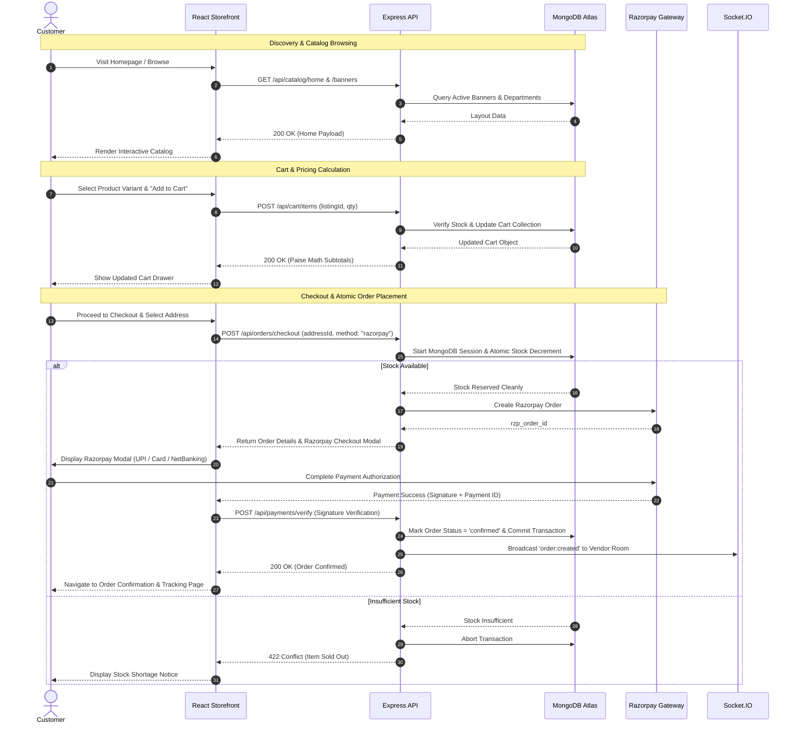

# Customer Journey & Shopping Workflow

```mermaid
sequenceDiagram
    autonumber
    actor C as Customer
    participant UI as React Storefront
    participant API as Express API
    participant DB as MongoDB Atlas
    participant GW as Razorpay Gateway
    participant WS as Socket.IO

    Note over C, DB: Discovery & Catalog Browsing
    C->>UI: Visit Homepage / Browse
    UI->>API: GET /api/catalog/home & /banners
    API->>DB: Query Active Banners & Departments
    DB-->>API: Layout Data
    API-->>UI: 200 OK (Home Payload)
    UI-->>C: Render Interactive Catalog

    Note over C, DB: Cart & Pricing Calculation
    C->>UI: Select Product Variant & "Add to Cart"
    UI->>API: POST /api/cart/items (listingId, qty)
    API->>DB: Verify Stock & Update Cart Collection
    DB-->>API: Updated Cart Object
    API-->>UI: 200 OK (Paise Math Subtotals)
    UI-->>C: Show Updated Cart Drawer

    Note over C, GW: Checkout & Atomic Order Placement
    C->>UI: Proceed to Checkout & Select Address
    UI->>API: POST /api/orders/checkout (addressId, method: "razorpay")
    API->>DB: Start MongoDB Session & Atomic Stock Decrement
    alt Stock Available
        DB-->>API: Stock Reserved Cleanly
        API->>GW: Create Razorpay Order
        GW-->>API: rzp_order_id
        API-->>UI: Return Order Details & Razorpay Checkout Modal
        UI->>C: Display Razorpay Modal (UPI / Card / NetBanking)
        C->>GW: Complete Payment Authorization
        GW-->>UI: Payment Success (Signature + Payment ID)
        UI->>API: POST /api/payments/verify (Signature Verification)
        API->>DB: Mark Order Status = 'confirmed' & Commit Transaction
        API->>WS: Broadcast 'order:created' to Vendor Room
        API-->>UI: 200 OK (Order Confirmed)
        UI-->>C: Navigate to Order Confirmation & Tracking Page
    else Insufficient Stock
        DB-->>API: Stock Insufficient
        API->>DB: Abort Transaction
        API-->>UI: 422 Conflict (Item Sold Out)
        UI-->>C: Display Stock Shortage Notice
    end
```
