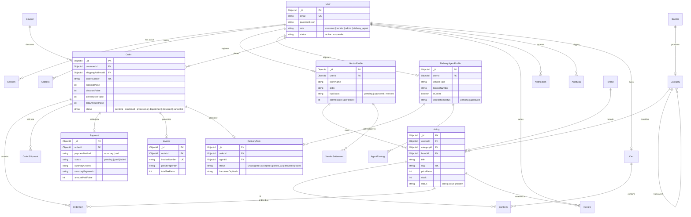

# VP Mart – Complete Database Entity Relationship Diagram

```mermaid
erDiagram
    User ||--o{ Session : "has active"
    User ||--o{ Address : "saves"
    User ||--o| VendorProfile : "registers"
    User ||--o| DeliveryAgentProfile : "registers"
    User ||--o{ Order : "places"
    User ||--o{ Review : "writes"
    User ||--o{ Notification : "receives"
    User ||--o{ AuditLog : "triggers"

    VendorProfile ||--o{ Listing : "owns"
    VendorProfile ||--o{ VendorSettlement : "receives"

    Category ||--o{ Listing : "classifies"
    Category ||--o{ Category : "has parent"
    Brand ||--o{ Listing : "brands"

    Listing ||--o{ CartItem : "in"
    Listing ||--o{ OrderItem : "ordered as"
    Listing ||--o{ Review : "reviewed in"

    Cart ||--o{ CartItem : "contains"
    User ||--o| Cart : "owns"

    Order ||--o{ OrderItem : "contains"
    Order ||--o{ OrderShipment : "split into"
    Order ||--o| Payment : "settled via"
    Order ||--o| Invoice : "generates"
    Order ||--o| DeliveryTask : "fulfilled by"

    DeliveryAgentProfile ||--o{ DeliveryTask : "delivers"
    DeliveryAgentProfile ||--o{ AgentEarning : "earns"

    Coupon ||--o{ Order : "discounts"
    Banner ||--o| Category : "promotes"

    User {
        ObjectId _id PK
        string email UK
        string passwordHash
        string role "customer | vendor | admin | delivery_agent"
        string status "active | suspended"
    }

    VendorProfile {
        ObjectId _id PK
        ObjectId userId FK
        string storeName
        string gstin
        string kycStatus "pending | approved | rejected"
        int commissionRatePercent
    }

    DeliveryAgentProfile {
        ObjectId _id PK
        ObjectId userId FK
        string vehicleType
        string licenseNumber
        boolean isOnline
        string verificationStatus "pending | approved"
    }

    Listing {
        ObjectId _id PK
        ObjectId vendorId FK
        ObjectId categoryId FK
        ObjectId brandId FK
        string title
        string slug UK
        int pricePaise
        int stock
        string status "draft | active | hidden"
    }

    Order {
        ObjectId _id PK
        ObjectId customerId FK
        ObjectId shippingAddressId FK
        string orderNumber UK
        int subtotalPaise
        int discountPaise
        int deliveryFeePaise
        int totalAmountPaise
        string status "pending | confirmed | processing | dispatched | delivered | cancelled"
    }

    Payment {
        ObjectId _id PK
        ObjectId orderId FK
        string paymentMethod "razorpay | cod"
        string status "pending | paid | failed"
        string razorpayOrderId
        string razorpayPaymentId
        int amountPaidPaise
    }

    DeliveryTask {
        ObjectId _id PK
        ObjectId orderId FK
        ObjectId agentId FK
        string status "unassigned | accepted | picked_up | delivered | failed"
        string handoverOtpHash
    }

    Invoice {
        ObjectId _id PK
        ObjectId orderId FK
        string invoiceNumber UK
        string pdfStoragePath
        int totalTaxPaise
    }
```
