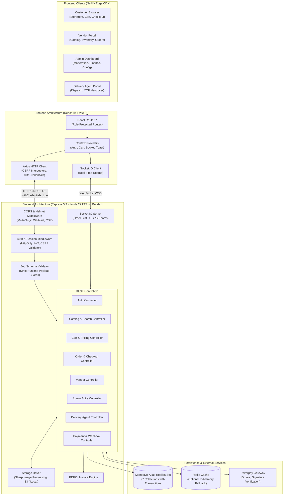

# System Architecture Diagram

```mermaid
flowchart TB
    subgraph Clients["Frontend Clients (Netlify Edge CDN)"]
        Customer["Customer Browser\n(Storefront, Cart, Checkout)"]
        Vendor["Vendor Portal\n(Catalog, Inventory, Orders)"]
        Admin["Admin Dashboard\n(Moderation, Finance, Config)"]
        Agent["Delivery Agent Portal\n(Dispatch, OTP Handover)"]
    end

    subgraph ClientLayer["Frontend Architecture (React 19 + Vite 8)"]
        Router["React Router 7\n(Role Protected Routes)"]
        Contexts["Context Providers\n(Auth, Cart, Socket, Toast)"]
        APIClient["Axios HTTP Client\n(CSRF Interceptors, withCredentials)"]
        SocketClient["Socket.IO Client\n(Real-Time Rooms)"]
    end

    subgraph BackendLayer["Backend Architecture (Express 5.3 + Node 22 LTS on Render)"]
        CORS["CORS & Helmet Middleware\n(Multi-Origin Whitelist, CSP)"]
        AuthMiddleware["Auth & Session Middleware\n(HttpOnly JWT, CSRF Validator)"]
        ZodValidator["Zod Schema Validator\n(Strict Runtime Payload Guards)"]
        
        subgraph Controllers["REST Controllers"]
            AuthController["Auth Controller"]
            CatalogController["Catalog & Search Controller"]
            CartController["Cart & Pricing Controller"]
            OrderController["Order & Checkout Controller"]
            VendorController["Vendor Controller"]
            AdminController["Admin Suite Controller"]
            DeliveryController["Delivery Agent Controller"]
            PaymentController["Payment & Webhook Controller"]
        end

        SocketServer["Socket.IO Server\n(Order Status, GPS Rooms)"]
        StorageService["Storage Driver\n(Sharp Image Processing, S3 / Local)"]
        InvoiceService["PDFKit Invoice Engine"]
    end

    subgraph Persistence["Persistence & External Services"]
        MongoDB[("MongoDB Atlas Replica Set\n27 Collections with Transactions")]
        RedisCache[("Redis Cache\n(Optional In-Memory Fallback)")]
        RazorpayGateway["Razorpay Gateway\n(Orders, Signature Verification)"]
    end

    Clients --> Router
    Router --> Contexts
    Contexts --> APIClient
    Contexts --> SocketClient

    APIClient <-->|HTTPS REST API\nwithCredentials: true| CORS
    SocketClient <-->|WebSocket WSS| SocketServer

    CORS --> AuthMiddleware
    AuthMiddleware --> ZodValidator
    ZodValidator --> Controllers

    Controllers --> MongoDB
    Controllers <--> RedisCache
    Controllers <--> StorageService
    Controllers --> InvoiceService
    Controllers <--> RazorpayGateway

    SocketServer --> Controllers
```
