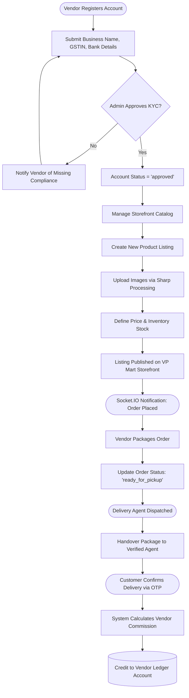

# Vendor Lifecycle & Order Fulfillment Workflow

```mermaid
flowchart TD
    Start([Vendor Registers Account]) --> KYC[Submit Business Name, GSTIN, Bank Details]
    KYC --> AdminReview{Admin Approves KYC?}
    
    AdminReview -- No --> Rejected[Notify Vendor of Missing Compliance]
    Rejected --> KYC
    AdminReview -- Yes --> Approved[Account Status = 'approved']
    
    Approved --> CatalogMgmt[Manage Storefront Catalog]
    CatalogMgmt --> AddListing[Create New Product Listing]
    AddListing --> ImageUpload[Upload Images via Sharp Processing]
    ImageUpload --> InventorySet[Define Price & Inventory Stock]
    InventorySet --> LiveMarket[Listing Published on VP Mart Storefront]
    
    LiveMarket --> OrderNotify([Socket.IO Notification: Order Placed])
    OrderNotify --> PackItem[Vendor Packages Order]
    PackItem --> MarkReady[Update Order Status: 'ready_for_pickup']
    
    MarkReady --> AgentDispatch([Delivery Agent Dispatched])
    AgentDispatch --> Handover[Handover Package to Verified Agent]
    Handover --> Delivered([Customer Confirms Delivery via OTP])
    
    Delivered --> Settlement[System Calculates Vendor Commission]
    Settlement --> LedgerCredit[(Credit to Vendor Ledger Account)]
```
